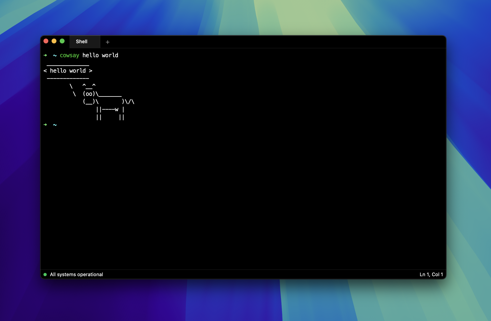

  <!--  -->
  

  <a href="">
    <!-- TODO: use GitHub workflow status -->
    
  </a>

<h1 align="center">hyper-two (ultra)</h1>

hyper two: electric boogaloo

## credits

built upon the groundbreaking [hyper](https://hyper.is/) project by [vercel](https://vercel.com/).
